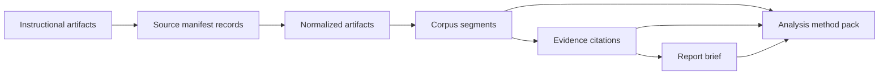

# Workflow Diagram

This project demonstrates a public-safe version of a reusable content
intelligence workflow: convert instructional artifacts into bounded information
objects, then use those objects to support search, citation, and reporting.

## Object Flow



## What Each Object Adds

| Stage | Object | Purpose |
| --- | --- | --- |
| Source inventory | `SourceManifestRecord` | Records source identity, type, license, checksum, and processing status. |
| Cleanup | `NormalizedArtifact` | Stores cleaned, public-safe text with stable source metadata. |
| Retrieval | `CorpusSegment` | Breaks cleaned artifacts into searchable, citation-preserving units. |
| Grounding | `EvidenceCitation` | Links report claims back to source segments. |
| Reporting | `ReportBrief` | Captures the structured analytical answer, evidence, and limitations. |
| Method transfer | `AnalysisMethodPack` | Gives an AI or algorithm reusable instructions for consuming the objects responsibly. |

## Reviewer Walkthrough

Run the full public demo:

```bash
make portfolio-demo
```

Then inspect:

- `sample_outputs/information-object-map.json` for the object inventory.
- `sample_outputs/report-brief.json` for source-grounded reporting output.
- `sample_outputs/analysis-method-pack.json` for the AI-readable method
  contract.

The cloud video and OCR demos preserve the private workflow pattern while using
synthetic public-safe records:

```bash
make media-demo
make ocr-demo
```

## Portfolio Claim

The useful artifact is not a transcript, a report, or a single script. The
useful artifact is the conversion pattern: raw instructional material becomes
structured information objects that can be searched, cited, audited, and safely
handed to downstream analytical systems.
